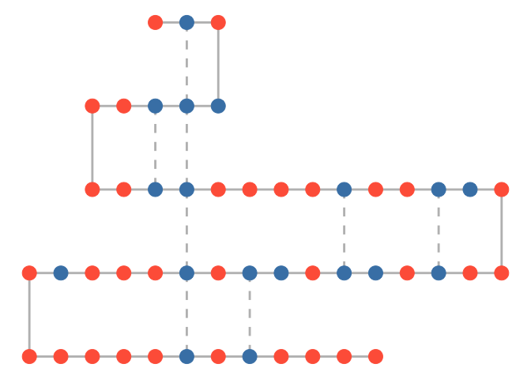

Protein Folding
================

This notebook contains a brief solution to the [Protein Folding Problem](https://books.google.co.uk/books?id=YJRh0tOes7UC&lpg=PP2&ots=wrSdP17rrY&lr&pg=PA289#v=onepage) using a Mixed Integer Program in AMPL and displaying the resulting chain using R's `ggnet` package.

Given a protein chain of two types of amino acids (hydrophilic and hydrophobic), we wish to fold the chain in such a way that the number of "matchings" between hydophobic acids is maximised. A matching is where two hydrophobic acids occupy adjacent grid points on a lattice but does not include successive acids in the chain.

Install and load required packages:

``` r
devtools::install_github("briatte/ggnet")
```

    ## Skipping install of 'ggnet' from a github remote, the SHA1 (da9a7cf2) has not changed since last install.
    ##   Use `force = TRUE` to force installation

``` r
library(ggnet)
library(network)
```

    ## network: Classes for Relational Data
    ## Version 1.13.0 created on 2015-08-31.
    ## copyright (c) 2005, Carter T. Butts, University of California-Irvine
    ##                     Mark S. Handcock, University of California -- Los Angeles
    ##                     David R. Hunter, Penn State University
    ##                     Martina Morris, University of Washington
    ##                     Skye Bender-deMoll, University of Washington
    ##  For citation information, type citation("network").
    ##  Type help("network-package") to get started.

Run the optimisation model with binary variables *y\[A,B\]* indicating a matching between hydrophobic acids *A* and *B* and *z\[C\]* indicating the beginning of a fold in the chain at acid *C*:

``` bash
ampl protein.run
```

    ## CPLEX 12.7.1.0: optimal integer solution; objective 8
    ## 3 MIP simplex iterations
    ## 0 branch-and-bound nodes
    ## :    _varname[j] _var[j]    :=
    ## 1     'y[2,4]'       0
    ## 2     'y[2,5]'       1
    ## 3     'y[2,6]'       0
    ## 4     'y[2,11]'      0
    ## 5     'y[2,12]'      0
    ## 6     'y[2,17]'      0
    ## 7     'y[2,20]'      0
    ## 8     'y[2,21]'      0
    ## 9     'y[2,25]'      0
    ## 10    'y[2,27]'      0
    ## 11    'y[2,28]'      0
    ## 12    'y[2,30]'      0
    ## 13    'y[2,31]'      0
    ## 14    'y[2,33]'      0
    ## 15    'y[2,37]'      0
    ## 16    'y[2,44]'      0
    ## 17    'y[2,46]'      0
    ## 18    'y[4,5]'       0
    ## 19    'y[4,6]'       0
    ## 20    'y[4,11]'      0
    ## 21    'y[4,12]'      0
    ## 22    'y[4,17]'      0
    ## 23    'y[4,20]'      0
    ## 24    'y[4,21]'      0
    ## 25    'y[4,25]'      0
    ## 26    'y[4,27]'      0
    ## 27    'y[4,28]'      0
    ## 28    'y[4,30]'      0
    ## 29    'y[4,31]'      0
    ## 30    'y[4,33]'      0
    ## 31    'y[4,37]'      0
    ## 32    'y[4,44]'      0
    ## 33    'y[4,46]'      0
    ## 34    'y[5,6]'       0
    ## 35    'y[5,11]'      0
    ## 36    'y[5,12]'      1
    ## 37    'y[5,17]'      0
    ## 38    'y[5,20]'      0
    ## 39    'y[5,21]'      0
    ## 40    'y[5,25]'      0
    ## 41    'y[5,27]'      0
    ## 42    'y[5,28]'      0
    ## 43    'y[5,30]'      0
    ## 44    'y[5,31]'      0
    ## 45    'y[5,33]'      0
    ## 46    'y[5,37]'      0
    ## 47    'y[5,44]'      0
    ## 48    'y[5,46]'      0
    ## 49    'y[6,11]'      1
    ## 50    'y[6,12]'      0
    ## 51    'y[6,17]'      0
    ## 52    'y[6,20]'      0
    ## 53    'y[6,21]'      0
    ## 54    'y[6,25]'      0
    ## 55    'y[6,27]'      0
    ## 56    'y[6,28]'      0
    ## 57    'y[6,30]'      0
    ## 58    'y[6,31]'      0
    ## 59    'y[6,33]'      0
    ## 60    'y[6,37]'      0
    ## 61    'y[6,44]'      0
    ## 62    'y[6,46]'      0
    ## 63    'y[11,12]'     0
    ## 64    'y[11,17]'     0
    ## 65    'y[11,20]'     0
    ## 66    'y[11,21]'     0
    ## 67    'y[11,25]'     0
    ## 68    'y[11,27]'     0
    ## 69    'y[11,28]'     0
    ## 70    'y[11,30]'     0
    ## 71    'y[11,31]'     0
    ## 72    'y[11,33]'     0
    ## 73    'y[11,37]'     0
    ## 74    'y[11,44]'     0
    ## 75    'y[11,46]'     0
    ## 76    'y[12,17]'     0
    ## 77    'y[12,20]'     0
    ## 78    'y[12,21]'     0
    ## 79    'y[12,25]'     0
    ## 80    'y[12,27]'     0
    ## 81    'y[12,28]'     0
    ## 82    'y[12,30]'     0
    ## 83    'y[12,31]'     0
    ## 84    'y[12,33]'     1
    ## 85    'y[12,37]'     0
    ## 86    'y[12,44]'     0
    ## 87    'y[12,46]'     0
    ## 88    'y[17,20]'     0
    ## 89    'y[17,21]'     0
    ## 90    'y[17,25]'     0
    ## 91    'y[17,27]'     0
    ## 92    'y[17,28]'     1
    ## 93    'y[17,30]'     0
    ## 94    'y[17,31]'     0
    ## 95    'y[17,33]'     0
    ## 96    'y[17,37]'     0
    ## 97    'y[17,44]'     0
    ## 98    'y[17,46]'     0
    ## 99    'y[20,21]'     0
    ## 100   'y[20,25]'     1
    ## 101   'y[20,27]'     0
    ## 102   'y[20,28]'     0
    ## 103   'y[20,30]'     0
    ## 104   'y[20,31]'     0
    ## 105   'y[20,33]'     0
    ## 106   'y[20,37]'     0
    ## 107   'y[20,44]'     0
    ## 108   'y[20,46]'     0
    ## 109   'y[21,25]'     0
    ## 110   'y[21,27]'     0
    ## 111   'y[21,28]'     0
    ## 112   'y[21,30]'     0
    ## 113   'y[21,31]'     0
    ## 114   'y[21,33]'     0
    ## 115   'y[21,37]'     0
    ## 116   'y[21,44]'     0
    ## 117   'y[21,46]'     0
    ## 118   'y[25,27]'     0
    ## 119   'y[25,28]'     0
    ## 120   'y[25,30]'     0
    ## 121   'y[25,31]'     0
    ## 122   'y[25,33]'     0
    ## 123   'y[25,37]'     0
    ## 124   'y[25,44]'     0
    ## 125   'y[25,46]'     0
    ## 126   'y[27,28]'     0
    ## 127   'y[27,30]'     0
    ## 128   'y[27,31]'     0
    ## 129   'y[27,33]'     0
    ## 130   'y[27,37]'     0
    ## 131   'y[27,44]'     0
    ## 132   'y[27,46]'     0
    ## 133   'y[28,30]'     0
    ## 134   'y[28,31]'     0
    ## 135   'y[28,33]'     0
    ## 136   'y[28,37]'     0
    ## 137   'y[28,44]'     0
    ## 138   'y[28,46]'     0
    ## 139   'y[30,31]'     0
    ## 140   'y[30,33]'     0
    ## 141   'y[30,37]'     0
    ## 142   'y[30,44]'     0
    ## 143   'y[30,46]'     0
    ## 144   'y[31,33]'     0
    ## 145   'y[31,37]'     0
    ## 146   'y[31,44]'     0
    ## 147   'y[31,46]'     1
    ## 148   'y[33,37]'     0
    ## 149   'y[33,44]'     1
    ## 150   'y[33,46]'     0
    ## 151   'y[37,44]'     0
    ## 152   'y[37,46]'     0
    ## 153   'y[44,46]'     0
    ## 154   'z[1]'         0
    ## 155   'z[2]'         0
    ## 156   'z[3]'         1
    ## 157   'z[4]'         0
    ## 158   'z[5]'         0
    ## 159   'z[6]'         0
    ## 160   'z[7]'         0
    ## 161   'z[8]'         1
    ## 162   'z[9]'         0
    ## 163   'z[10]'        0
    ## 164   'z[11]'        0
    ## 165   'z[12]'        0
    ## 166   'z[13]'        0
    ## 167   'z[14]'        0
    ## 168   'z[15]'        0
    ## 169   'z[16]'        0
    ## 170   'z[17]'        0
    ## 171   'z[18]'        0
    ## 172   'z[19]'        0
    ## 173   'z[20]'        0
    ## 174   'z[21]'        0
    ## 175   'z[22]'        1
    ## 176   'z[23]'        0
    ## 177   'z[24]'        0
    ## 178   'z[25]'        0
    ## 179   'z[26]'        0
    ## 180   'z[27]'        0
    ## 181   'z[28]'        0
    ## 182   'z[29]'        0
    ## 183   'z[30]'        0
    ## 184   'z[31]'        0
    ## 185   'z[32]'        0
    ## 186   'z[33]'        0
    ## 187   'z[34]'        0
    ## 188   'z[35]'        0
    ## 189   'z[36]'        0
    ## 190   'z[37]'        0
    ## 191   'z[38]'        1
    ## 192   'z[39]'        0
    ## 193   'z[40]'        0
    ## 194   'z[41]'        0
    ## 195   'z[42]'        0
    ## 196   'z[43]'        0
    ## 197   'z[44]'        0
    ## 198   'z[45]'        0
    ## 199   'z[46]'        0
    ## 200   'z[47]'        0
    ## 201   'z[48]'        0
    ## 202   'z[49]'        0
    ## ;

Load input data and optimisation results into R:

``` r
chain_length <- 50
is_hydophobic <- c(2, 4, 5, 6, 11, 12, 17, 20, 21, 25, 27, 28, 30, 31, 33, 37, 44, 46)
node_coords <- matrix(c(
  1,5,
  2,5,
  3,5,
  3,4,
  2,4,
  1,4,
  0,4,
  -1,4,
  -1,3,
  0,3,
  1,3,
  2,3,
  3,3,
  4,3,
  5,3,
  6,3,
  7,3,
  8,3,
  9,3,
  10,3,
  11,3,
  12,3,
  12,2,
  11,2,
  10,2,
  9,2,
  8,2,
  7,2,
  6,2,
  5,2,
  4,2,
  3,2,
  2,2,
  1,2,
  0,2,
  -1,2,
  -2,2,
  -3,2,
  -3,1,
  -2,1,
  -1,1,
  0,1,
  1,1,
  2,1,
  3,1,
  4,1,
  5,1,
  6,1,
  7,1,
  8,1
), nrow = chain_length, ncol = 2, byrow = TRUE)

# Build network using regular chain edges (matching = 0) and solved matching positions
edge_data <- data.frame(
  from=c(1:(chain_length-1), 2,5,6,12,17,20,31,33),
  to=c(2:chain_length, 5,12,11,33,28,25,46,44),
  matching=c(rep(0, (chain_length-1)), rep(1, 8))
)
#TODO Build an algorithm that node_coords and edge_data from AMPL results
#TODO Automate entire workflow using AMPL's Python API (would require transfer to R using Feather...)
```

Plot the resulting protein chain

``` r
net <- network.edgelist(edge_data, network.initialize(chain_length), ignore.eval = FALSE, names.eval = "matching")
net %v% "is_hydophobic" = ifelse(net %v% "vertex.names" %in% is_hydophobic, TRUE, FALSE)
net %v% "color" = ifelse(net %v% "is_hydophobic", "steelblue", "tomato")
set.edge.attribute(net, "lty", ifelse(net %e% "matching" == 0, 1, 2))

ggnet2(net, mode = node_coords, node.size = 6, color = "color", edge.size = 1, edge.color = "grey", edge.lty = "lty")
```

    ## Loading required package: sna

    ## Loading required package: statnet.common

    ## 
    ## Attaching package: 'statnet.common'

    ## The following object is masked from 'package:base':
    ## 
    ##     order

    ## sna: Tools for Social Network Analysis
    ## Version 2.4 created on 2016-07-23.
    ## copyright (c) 2005, Carter T. Butts, University of California-Irvine
    ##  For citation information, type citation("sna").
    ##  Type help(package="sna") to get started.

    ## Loading required package: scales


